# MacDub

<p align="center">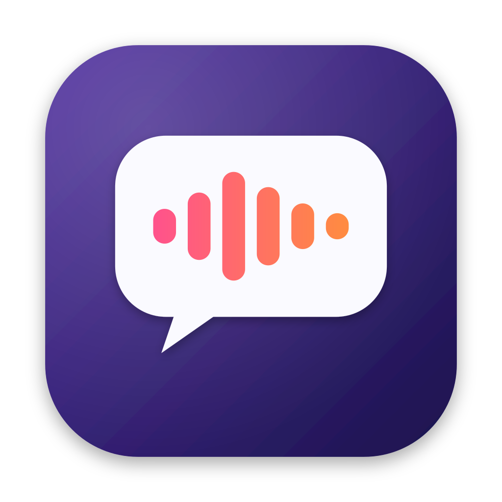</p>

**Real-time, fully offline dubbing for macOS.**

MacDub captures the audio of any app (Zoom, Teams, VLC, Safari, Chrome, Music — or the whole system), transcribes it, translates it and reads the translation aloud with a system voice, keeping the original quietly in the background like a documentary. Everything runs on your Mac with Apple's own frameworks. No cloud, no API keys, no virtual audio drivers, and the microphone is never touched.

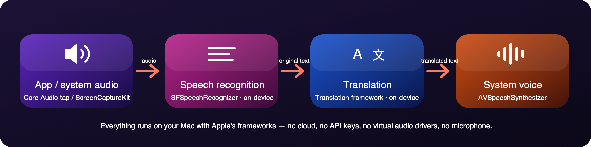

## Screenshots

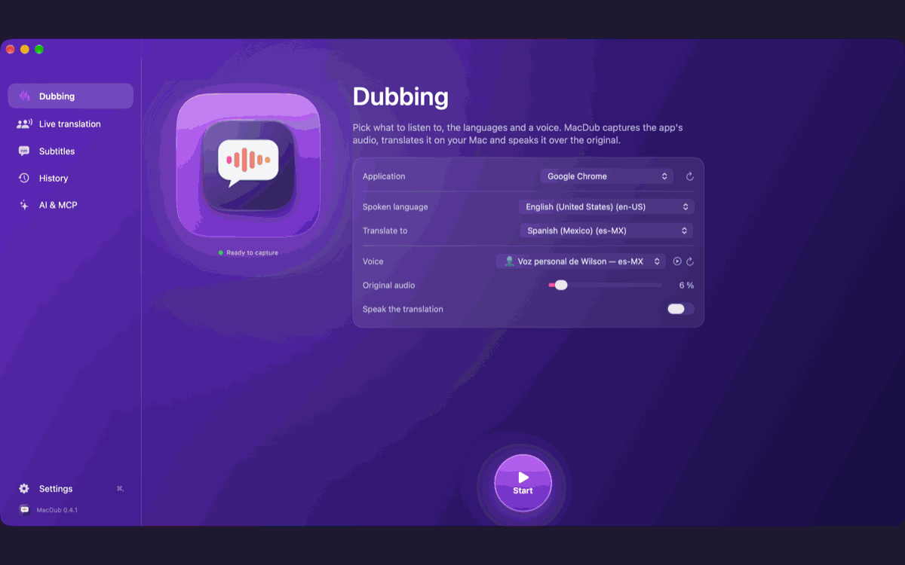

The screenshots below were taken while MacDub dubbed Apple's WWDC25 session [*Bring advanced speech-to-text to your app with SpeechAnalyzer*](https://www.youtube.com/watch?v=0m6dimDDj8M) playing in Google Chrome, English → Spanish.

| | |
|---|---|
| **Dubbing** — pick the app, the languages and a voice, press Start 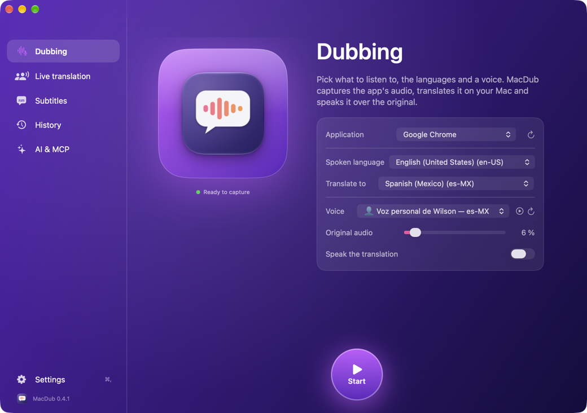 | **Live transcript** — original + translation, the word being spoken highlighted, latency per sentence 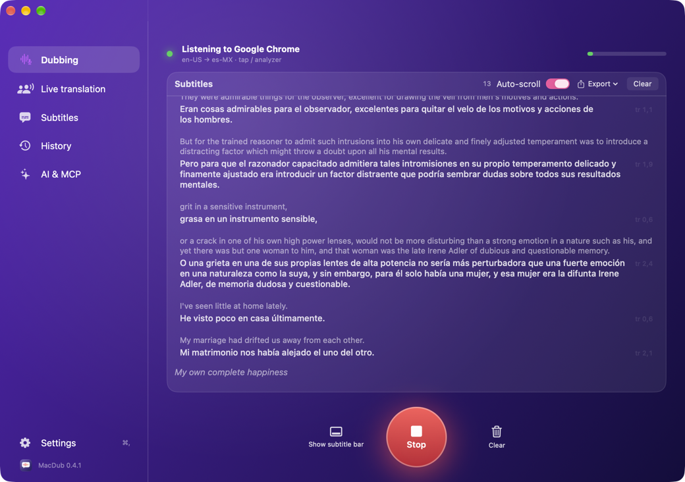 |
| **Floating subtitle bar** — always on top of the video you are watching 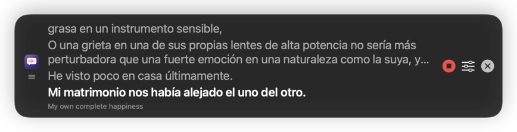 | **Menu bar panel** — status, last lines, Start/Stop and quick controls 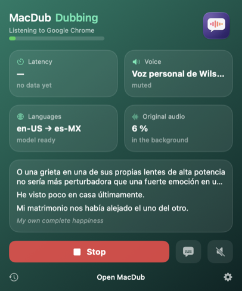 |
| **Live translation** *(beta)* — call app, microphone, both languages, a voice for each side, audio and/or chat 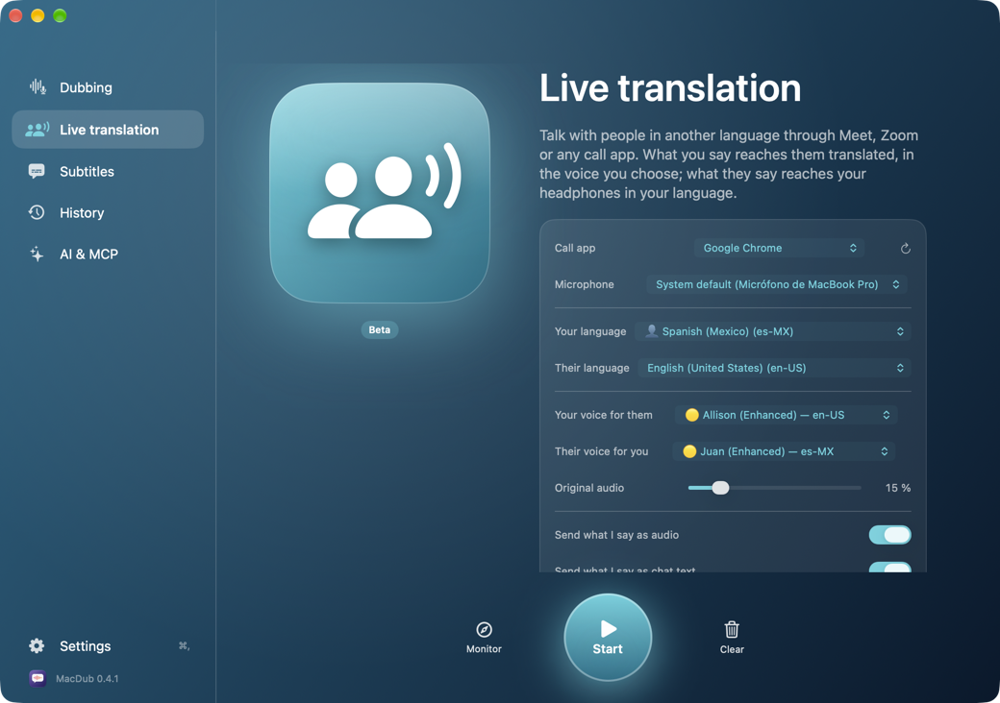 | **Live conversation** — you and them side by side, a "…" bubble while someone speaks, transcription · audio · total per sentence 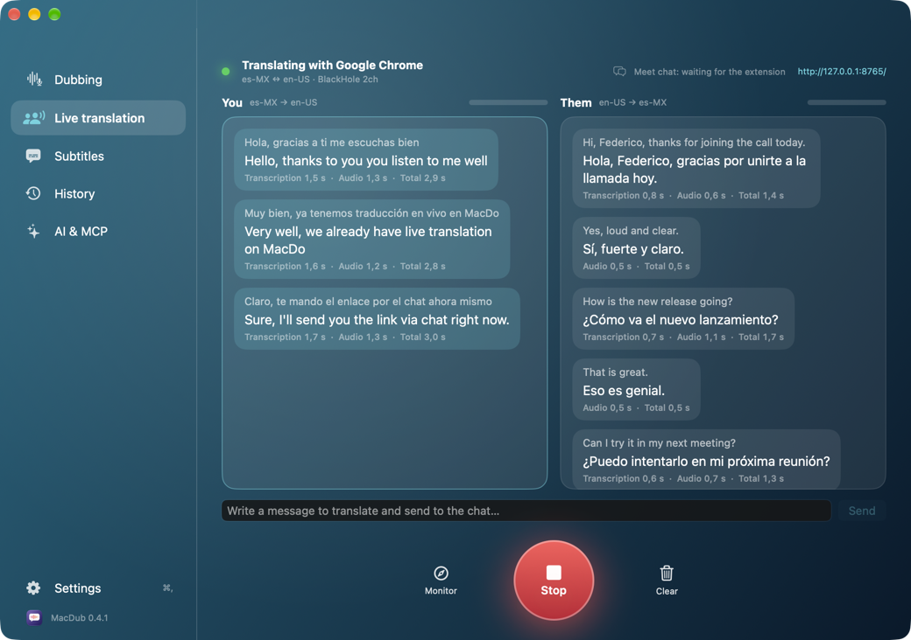 |
| **History › Dubbing** — recorded audio with a live spectrum, the transcript following karaoke-style, playback modes 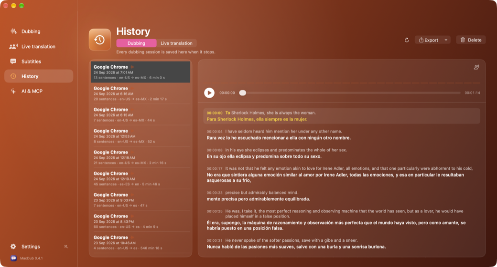 | **History › Live translation** — each conversation as a chat, both sides' audio in one take, times per sentence 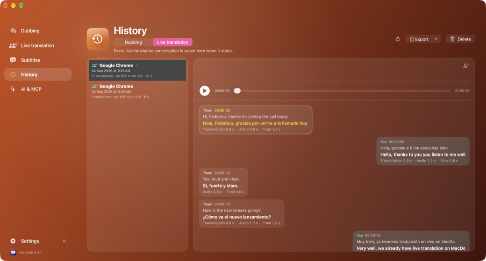 |
| **Subtitles** — transcript options, floating bar and exports 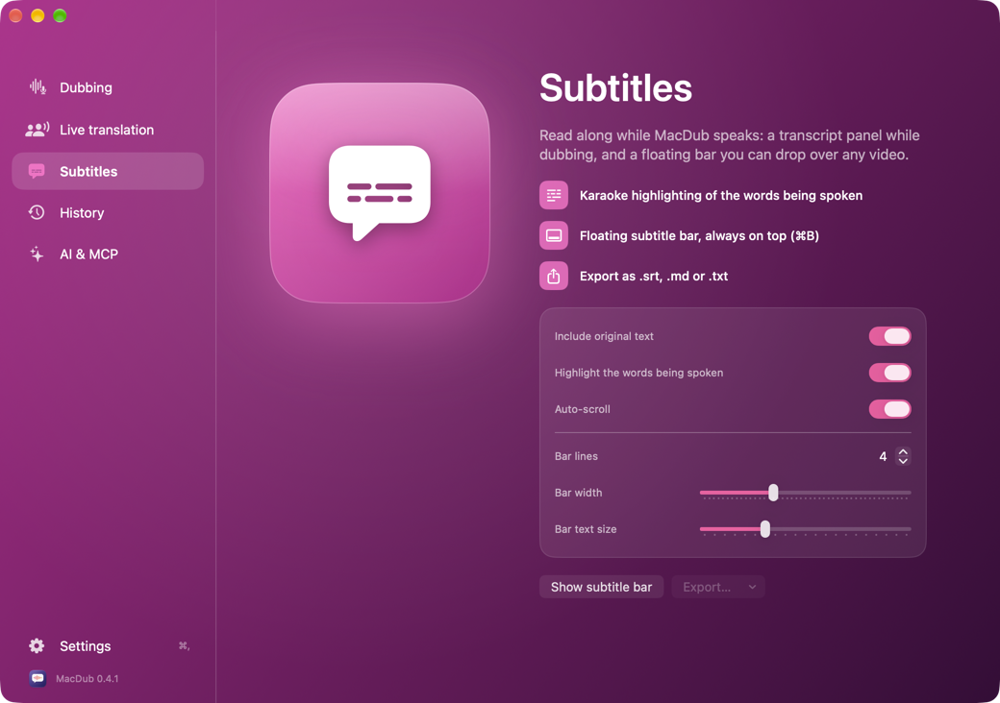 | **AI & MCP** — local summaries and one-click MCP registration 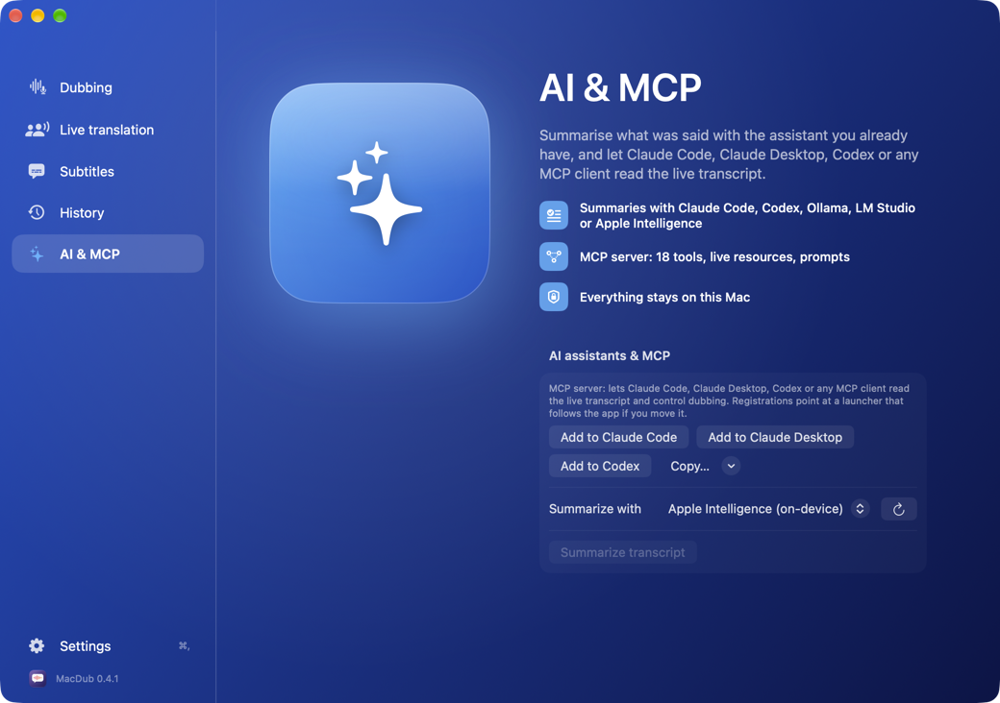 |
| **Settings** — General, Capture, Speech, Voice, Subtitles, AI & MCP, Extensions, Permissions 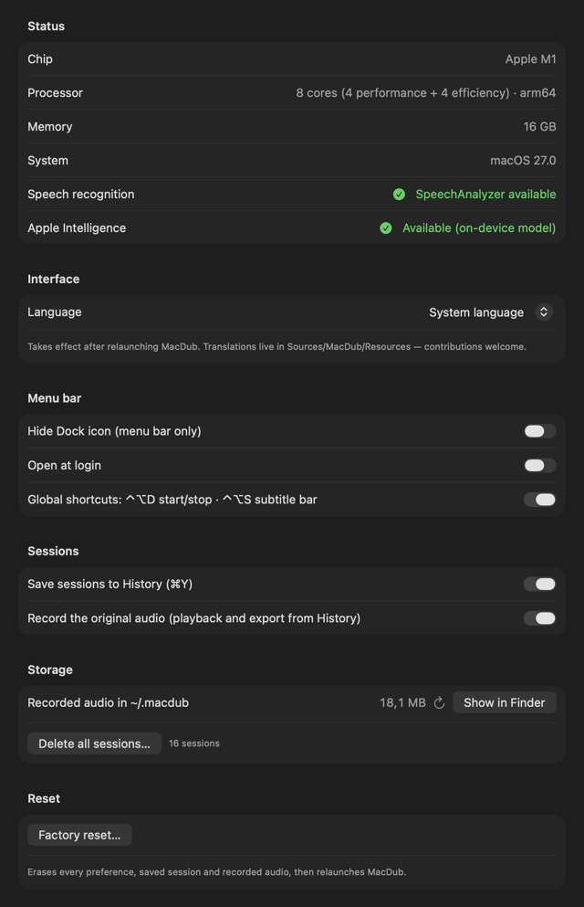 | **Settings › Voice** — quality badges and your own Personal Voice 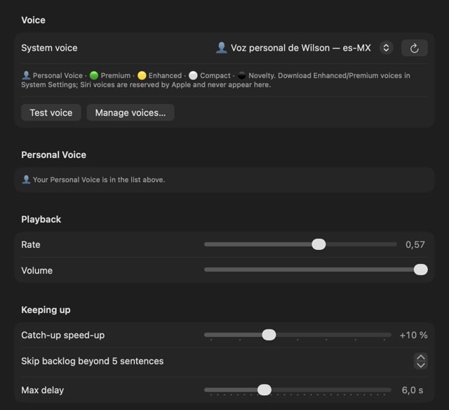 |
| **Settings › Extensions** — the Google Meet extension for live translation, one click to install 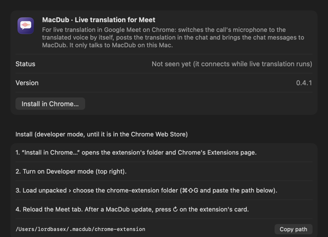 | |

- macOS **15 Sequoia or later** (developed on 15.7.3, also built and run on macOS 26.7 / Apple M1).
- Universal binary — Intel and Apple Silicon.
- Builds **without Xcode**: the Command Line Tools are enough.
- Interface in English, Spanish and Portuguese (Brazil); easy to add more.
- MIT licensed. Repository: **https://github.com/lordbasex/macdub**
- Created by **Federico Pereira** <lord.basex@gmail.com>

---

## Features

| Area | Feature | Details |
|---|---|---|
| **Capture** | One app or the entire system | Per-app capture follows helper processes (Chrome/Electron helpers, WebKit for Safari); "🔊 Entire system" captures everything except MacDub's own voice. Zoom, Teams, VLC, browsers, Music… The microphone is never captured. |
| | Original audio in the background | Core Audio *process tap* engine: the original is removed from the output and re-played at the level you choose (default 25 %), or lowered only while the translated voice speaks — documentary style. |
| | ScreenCaptureKit fallback | Used automatically when the app has no audio process yet (no background mix in that mode). |
| | Audio buffer for snippets | The last 60 s (configurable in *Settings › AI & MCP*, 0 = off) stay in memory so an assistant can request a WAV excerpt through MCP; never written to disk unless asked. |
| **Recognition** | On-device speech recognition | `SFSpeechRecognizer` with on-device models (macOS 15+). |
| | `SpeechAnalyzer` on macOS 26 | Chosen automatically when the OS offers it; live fallback to `SFSpeechRecognizer` if it fails; compiled out on older toolchains. MacDub translates and speaks its *finalized* results — whole, corrected, punctuated sentences (85–92 % of sentences in one piece in the [benchmark](docs/benchmarks/), against 35 % segmenting its volatile results) — and shows the volatile text live. The engine can be picked in *Settings › Capture › Engine*, which also says which one was detected and which one is running. |
| | Smart sentence segmentation | Cuts on punctuation, clause marks, length, pending time and silence; re-anchors when the recognizer rewrites earlier words. Unit-tested. |
| **Translation** | On-device translation | Apple's `Translation` framework, 21 languages, models downloaded once. |
| **Live translation** *(beta, macOS 26+)* | Talk through Meet, Zoom or any call app | What you say reaches the call translated, in the voice you choose (your Personal Voice included), through a virtual microphone ([BlackHole](https://existential.audio/blackhole/), installed from MacDub with one click); what they say reaches your headphones in your language. Two SpeechAnalyzers at once with fast results: about 1.8 s from the end of a sentence to its translated voice. |
| | Google Meet extension | Switches Meet's microphone to the translated voice by itself (and back when you stop), posts your translation in the chat and translates the chat messages — *Settings › Extensions*. |
| | Conversation view | Chat-style, with a "…" bubble while someone speaks and, for each sentence, transcription · audio · total times; choose the microphone, the languages (those on your Mac first) and a voice for each side. |
| **Voice** | System voices with quality badges | 🟢 Premium · 🟡 Enhanced · ⚪ Compact · ⚫ novelty; per-voice rate and volume; one-click reload after downloading voices. (Siri voices are not available to third-party apps.) |
| | Personal Voice | Dub with **your own voice**: the Personal Voice recorded in *System Settings › Accessibility › Personal Voice* appears first in the list (👤) once MacDub is allowed to use it (*Settings › Voice › Personal Voice › Allow…*). Apple supports it from **macOS 14 Sonoma**, so every macOS MacDub runs on (15+); creating the voice needs a Mac with Apple silicon, and apps cannot create one — *Create in System Settings…* opens the pane. It speaks the language it was recorded in. |
| | Latency management | Gentle speed-up when behind (configurable or off), stale sentences skipped past *Max delay*, backlog dropped with one click. Measured: translation ≈ 0.4 s, sentence end → voice ≈ 0.8 s with an empty queue, ≈ 2 s mean. |
| | Karaoke highlighting | The word being spoken is highlighted in the panel, the floating bar and the menu bar panel. |
| **Subtitles** | Transcript | While dubbing, the Dubbing screen becomes the live transcript: original + translation, per-sentence latency, level meter, skip/clear. The Subtitles screen holds the transcript options and exports; subtitles-only mode = voice off. |
| | Floating subtitle bar (⌘B) | Always-on-top pill: 1–6 lines, adjustable width and text size, drag handle, Stop/Start, quick settings, hide. |
| **Menu bar** | Status icon | Green dot while dubbing, amber while starting; click for a panel with the last lines, Start/Stop and quick controls; right-click for a menu. |
| | Menu-bar-only mode | Hide the Dock icon; open at login. |
| | Automation | Auto-start when the selected app starts playing audio; silence watchdog (notice or automatic stop). |
| **Shortcuts** | Global | ⌃⌥D start/stop · ⌃⌥S subtitle bar (no Accessibility permission needed). |
| | In-app | ⌘R start/stop · ⌘B subtitle bar · ⌘K skip backlog · ⌘L clear (starts a new session) · ⌘E export .srt · ⇧⌘E export .md · ⌘Y history · ⌘, settings. |
| **Transcripts** | Export | `.srt` (translation / original / both), `.md` with a session header (made for LLMs), `.txt`. File names carry no spaces (`macdub-transcript-<date>.<ext>`). |
| | Session history (⌘Y) | Every session archived when it stops, with the original audio recorded as AAC (`~/.macdub/audio`). Play it back with a live spectrum while the transcript follows karaoke-style — original audio only, documentary style (original lowered under the translated voice) or translated voice only, with original / translated / both texts, remembered between sessions; export audio + `.srt` under one name (`macdub-audio-<date>.m4a/.srt`) so VLC picks the subtitles up; delete a session and its audio goes with it. Settings › General shows the size of `~/.macdub` and offers *Delete all sessions* and *Factory reset*. |
| **AI** | Summaries | Claude Code and Codex CLIs, Ollama and LM Studio (choose the model), Apple Intelligence on macOS 26, or paste into Claude Desktop / ChatGPT — in the dubbing target language. A live seconds counter runs while it works; the summary shows how long it took and the tokens used (input/output; exact for Apple Intelligence on 26.4+, Claude Code, Ollama and LM Studio, ≈ estimated for Codex) plus the cost for Claude Code. |
| | MCP server | 18 tools (including History: list/delete sessions, export audio + `.srt`, storage usage), live resources with push notifications, saved sessions as resources, 3 prompts; stdio and Streamable HTTP transports; server-side summaries with local models; one-click registration for Claude Code, Claude Desktop and Codex that survives moving the app. |
| **Platform** | Requirements | macOS 15 Sequoia or later (tested on 15.7.3 and 26.7), Intel and Apple Silicon (universal binary). |
| | System status | *Settings › General › Status*: chip, cores (performance + efficiency), memory, macOS version, the speech engine in use and Apple Intelligence availability (with the reason when it is off). |
| | Build | No Xcode needed — Command Line Tools with Swift 6; `make setup` installs them if missing. No third-party dependencies. |
| | Languages | Interface in English, Spanish and Portuguese (Brazil); adding one is copying a folder. |
| | Quality | Unit tests (Swift Testing), CI on GitHub Actions, release script with notarization and Homebrew cask. |
| | License | MIT. |

---

## Install

### Homebrew

```bash
brew tap lordbasex/macdub https://github.com/lordbasex/macdub
brew install --cask macdub
```

### Download

Grab `MacDub-<version>.dmg` from the [Releases](https://github.com/lordbasex/macdub/releases) page, open it and drag MacDub to the Applications folder shown next to it (a `.zip` with the bare app is there too). Until releases are notarized, right-click › Open the first time.

### Build from source (no Xcode needed)

```bash
git clone https://github.com/lordbasex/macdub.git
cd macdub
make setup      # checks macOS 15+, Command Line Tools with Swift 6, SDK frameworks; creates the dev signing cert
make check      # quick type-check (debug build, no bundle)
make run        # native-arch build → build/MacDub.app, then launches it
make            # universal (x86_64 + arm64) build
make zip        # universal zip to try on another Mac
make dmg        # universal build packed as a drag-to-Applications disk image (build/MacDub-<version>.dmg)
make test       # unit tests
```

`make dmg` needs only macOS tools (`hdiutil`, `SetFile`, `osascript`); the mounted image shows the MacDub icon, a background with an arrow, the app and an Applications shortcut. The Finder layout step asks once for permission to control Finder. `make dmg-native` packs the current `build/MacDub.app` without rebuilding.

There are **no third-party dependencies** — nothing is downloaded. The only requirement is macOS 15+ with the Command Line Tools (Swift ≥ 6.0). On a fresh Mac, `make setup` (or the first `make run`) launches `xcode-select --install` for you, waits for Apple's installer to finish, verifies the SDK and creates the dev signing certificate.

**SDKs.** The same sources build with the macOS 15, 26 and 27 SDKs, with Xcode or with the Command Line Tools alone. CI builds, tests and packages with all three on every push. The SDK decides which macOS 26 features are compiled in; at run time each of them is still checked (`#available`), so a build made with a newer SDK runs on macOS 15 too.

| SDK | Toolchain (CI uses the Xcode listed) | SpeechAnalyzer | Apple Intelligence summaries | Notes |
|---|---|---|---|---|
| macOS 15.x | Xcode 16.4 · CLT 16 (Swift 6.0/6.1) | — | — | `SFSpeechRecognizer` only; everything else identical. |
| macOS 26.x | Xcode 26 · CLT 26 (Swift 6.2+) | ✓ on macOS 26 | ✓ on macOS 26 (exact token counts on 26.4+) | Recommended. |
| macOS 27.x | Xcode 27 | ✓ on macOS 26+ | ✓ on macOS 26+ | With the **Command Line Tools** only, the 27 SDK's `@State` macro needs a `SwiftUIMacros` plugin the CLT don't ship: `scripts/swift-flags.sh` then builds against the newest installed SDK that doesn't need it (e.g. 26.5) and prints which one. |

Check which SDK a build uses with `xcrun --show-sdk-version`; force one with `SDKROOT=$(xcrun --sdk macosx26.5 --show-sdk-path) make dmg`. *Settings › General › Status* in the app says whether the running build has the macOS 26 features compiled in.

**Signing for development.** The build script signs with a self-signed "MacDub Dev" certificate if it exists (created by `make setup` / `scripts/make-dev-cert.sh`), otherwise ad-hoc. Ad-hoc identities change on every build and macOS then drops the Screen Recording grant, so the certificate is worth having.

## First run

1. **Screen & System Audio Recording** — macOS asks on first launch. Enable MacDub in *System Settings › Privacy & Security* and **relaunch the app** (macOS only applies this grant after a relaunch).
2. **Speech Recognition** — requested when you first press Start.
3. **Spoken language** — pick one marked as on-device. If it says *needs download*, add the language under *System Settings › Keyboard › Dictation* so macOS fetches the model.
4. **Translate to** — the first time a language pair is used, *Settings › Speech › Prepare translation* downloads the model (needs internet that one time); MacDub also offers it when you press Start.
5. **Voice** — choose a voice and press ▶ to hear it. For better voices: *Settings › Voice › Manage voices…* → *Accessibility › Spoken Content › System Voice › Manage Voices*, download **Enhanced/Premium** voices, then ↻. To dub with your own voice, record a Personal Voice in the dubbing language and allow it in *Settings › Voice › Personal Voice*.
6. Pick **what to capture** (an app or 🔊 Entire system), play something and press **Start** (⌘R).

> With the tap engine the app must already be producing audio when you press Start; otherwise MacDub tells you and falls back to ScreenCaptureKit (no background mix).

## The app

One dark window with a sidebar of four screens, plus a standard Settings window (⌘,) and a menu bar item.

| Screen | What is there |
|---|---|
| **Dubbing** | The session choices: application (or 🔊 Entire system), spoken language, target language, voice with ▶ test, original audio level, speak on/off, and the round **Start** button. While dubbing the hero is replaced by the live transcript (karaoke highlighting, latency per sentence, level meter, Skip / Clear). |
| **Subtitles** | Transcript options (include original, highlight spoken words, auto-scroll), the floating subtitle bar (⌘B) and the exports (.srt / .md / .txt). |
| **History** (⌘Y) | Saved sessions with a player: spectrum, transport, scrubber, and the transcript following the audio karaoke-style. The ⋯ icon on the player picks what you hear (original only · documentary: original low under the translated voice · translated voice only) and what you read (original · translation · both); the choice is remembered. Export audio + `.srt`, or transcripts; delete removes the audio too. |
| **AI & MCP** | Summaries with a local assistant (Claude Code / Codex CLIs, Ollama, LM Studio, Apple Intelligence) and one-click MCP registration for Claude Code, Claude Desktop and Codex. |

**Settings (⌘,)** — *General* (interface language, menu-bar-only mode, open at login, global shortcuts, sessions & audio recording, storage size of `~/.macdub`, delete all sessions, factory reset) · *Capture* (engine, original level, auto-start, silence watchdog) · *Speech* (recognition engine, silence cut-off, translation model) · *Voice* (voice, rate, volume, catch-up policy) · *Subtitles* (transcript and floating bar) · *AI & MCP* (HTTP transport, audio buffer for snippets) · *Permissions*.

**Menu bar** — green dot while dubbing; click for a panel with the last lines, Start/Stop and quick controls; right-click for a menu (start/stop, subtitle bar, settings, history, about, quit).

## MCP server

| Kind | Name | What it does |
|---|---|---|
| tool | `get_status` | phase, app, languages, engines, latency, silence, available apps |
| tool | `get_transcript` | current session as `md` (default), `txt`, `srt` or `json`; `content` original/translated/both; ranges: `last` N, `sinceIndex` (incremental reads — json returns `nextIndex`), `fromSeconds`/`toSeconds` |
| tool | `summarize_transcript` | summary produced **by a local model on the Mac** (Apple Intelligence on macOS 26, Ollama, LM Studio) so the transcript never enters the client's context; same range options, `sessionId` for saved sessions |
| tool | `list_local_models` | which local summarisation providers/models exist |
| tool | `search_transcript` | find sentences containing a phrase, with timestamps |
| tool | `list_sessions` / `get_session` / `delete_session` | saved sessions (with `audioPath` when the original audio was recorded) and their transcripts; delete removes transcript and audio |
| tool | `get_storage` | disk used by recorded audio (`~/.macdub`) and transcripts, sessions with/without audio — for clean-ups |
| tool | `export_session` | write the live or a saved session to a file (srt/md/txt, `path`, `overwrite`) and return its path; format `audio` copies a saved session's original audio as `<name>.m4a` next to `<name>.srt` so VLC loads the subtitles automatically (`macdub-audio-<date>` by default) |
| tool | `get_audio_snippet` | the last N seconds of captured audio as a 16 kHz mono WAV (file path, or embedded audio content with `inline`) — to double-check a sentence with an audio-capable model; MacDub keeps 60 s in memory by default (*Settings › AI & MCP › Keep audio for snippets*) |
| tool | `start_dubbing` / `stop_dubbing` / `clear_transcript` | control the app (`bundleIdentifier` or `system`; apps launched after MacDub are picked up, and the start is confirmed with the engines in use) |
| tool | `set_languages`, `set_voice`, `set_speak`, `set_original_volume` | change languages (while idle), voice, mute the dub, background level — live |
| resource | `macdub://transcript`, `macdub://status` | attachable live context; **subscribable** — the server pushes `notifications/resources/updated` as sentences arrive |
| resource | `macdub://sessions/<id>` (+ `/md|txt|srt|json`) | every saved session is listed as a resource (and offered as templates) so it can be attached as context; `list_changed` fires when sessions are added or deleted |
| prompt | `summarize`, `action_items`, `check_translation` | ready-made instructions over the live transcript |

Register from the app (*AI & MCP › Add to Claude Code / Claude Desktop / Codex*) or by hand:

```bash
# stdio (recommended: Claude Code starts the server on demand). The launcher below is written by
# MacDub on launch and follows the app if you move it; the bundle path works too.
claude mcp add --scope user macdub "$HOME/Library/Application Support/MacDub/bin/macdub-mcp"
# HTTP (when the app serves it: Settings › AI & MCP › Also serve over HTTP)
claude mcp add --transport http --scope user macdub-http http://127.0.0.1:8765/mcp
```

```json
{ "mcpServers": { "macdub": { "command": "/Users/<you>/Library/Application Support/MacDub/bin/macdub-mcp" } } }
```

How it works: the app writes `~/Library/Application Support/MacDub/live.json` a few times per second and archives sessions in `sessions/` (recorded audio goes to `~/.macdub/audio/<id>.m4a`); the server reads those files and sends commands back through `DistributedNotificationCenter`. MacDub must be running for live data; saved sessions, storage and exports work even when it is not.

**Transports.** stdio by default. `macdub-mcp --http 8765 [--token SECRET]` serves the MCP *Streamable HTTP* transport at `http://127.0.0.1:8765/mcp` (POST for requests and batches, GET with `Accept: text/event-stream` for server notifications, optional bearer token, non-localhost `Origin` rejected). It binds to loopback only; for a remote assistant put it behind a tunnel or reverse proxy with TLS. The app can run it for you: *Settings › AI & MCP › Also serve over HTTP on port*.

## Architecture

```
Sources/MacDubCore/            Pure logic, no UI frameworks, unit-tested:
                               Segment, TranscriptSegmenter, TranscriptExporter (srt/md/txt + cue timing),
                               Karaoke (word timing for playback), SpeechRate, LiveState,
                               SessionStore + MacDubPaths (~/.macdub)
Sources/MacDubMCP/main.swift   MCP server (JSON-RPC over stdio) → Contents/Helpers/macdub-mcp
Sources/MacDub/
  App/                         MacDubApp (scenes, menus), AppState (pipeline coordinator),
                               AppDelegate, StatusBarController (menu bar)
  Audio/                       ProcessTapCaptureManager (Core Audio tap, default),
                               AudioCaptureManager (ScreenCaptureKit fallback), AudioRingBuffer,
                               SessionAudioRecorder (AAC take per session), SessionPlayer (+ FFT spectrum)
  Speech/                      SpeechAndTranslationManager, RecognitionEngine (+ SFSpeechEngine),
                               SpeechAnalyzerEngine (macOS 26), TranslationBridge
  Voice/                       VoiceSynthesisManager (AVSpeechSynthesizer + backlog policy)
  UI/                          MainView (sidebar + sections), SettingsView (⌘,), Theme (building blocks),
                               SubtitlesView, FloatingSubtitlesView (pill), MenuBarPanelView,
                               HistoryView (player + karaoke transcript), AIIntegrationView, SpokenText
  Support/                     Settings, Localization, AIIntegration (summaries, MCP install),
                               AppleIntelligenceSummarizer, GlobalHotKey, LaunchAtLogin, errors
  Resources/<lang>.lproj/      Localizable.strings
Tests/Runner/                  Swift Testing suites + executable runner
Packaging/                     Info.plist template, entitlements, AppIcon.icns, dmg-background.tiff
graphics/                      logo.svg (vector twin of the app icon), pipeline.svg (the diagram above)
images/                        Screenshots and the rendered pipeline diagram used by this README
scripts/                       build-app.sh, run.sh, make-dev-cert.sh, make-icon.swift,
                               make-dmg.sh + make-dmg-background.swift, sign-and-notarize.sh,
                               release.sh, reset-permissions.sh
Casks/macdub.rb                Homebrew cask (updated by release.sh)
.github/workflows/ci.yml       Build, test, universal artifact, draft release on tags
```

**Capture.** *Tap engine:* `CATapDescription(stereoMixdownOfProcesses:)` over the app's audio processes (its pid, child processes, bundle-id prefixes, WebKit for Safari) or `stereoGlobalTapButExcludeProcesses` for the whole system, with `muteBehavior = .mutedWhenTapped`; the tap sits in a private aggregate device with the default output, and the IO callback copies input → output scaled by the chosen gain and produces a mono copy for recognition. *ScreenCaptureKit engine:* an audio-only `SCStream` with `SCContentFilter(display:including:)` / `excludingApplications:`, `excludesCurrentProcessAudio = true`.

**Recognition & segmentation.** A `RecognitionEngine` streams a continuously revised transcript. `TranscriptSegmenter` cuts it as soon as a sentence terminator appears, at a clause mark past 90 characters, at the last space before 160, after 4.5 s of pending text without a pause, or on silence; when the recognizer rewrites earlier words it aligns the words already emitted with the new text, so nothing is spoken twice. `SFSpeechRecognizer` gets its own rules: sentence ends also come from a pause in the audio followed by a stall in the text, a period at the end of a partial result waits for the next word, and a transcript the recognizer restarts inside a task is detected. Its runs are rotated on real silence, on errors, and at a pause 30–45 s in; a rotated run finishes its audio rather than being cancelled, so no words are dropped at the seam.

**Translation.** `TranslationSession` only exists inside SwiftUI's `.translationTask`; an invisible `TranslationHostView` keeps that closure alive as a job loop.

**Voice.** `AVSpeechSynthesizer` serializes utterances; MacDub adds a catch-up policy (rate boost per queued sentence, capped), stale-sentence skipping and backlog dropping, plus per-word highlighting through `willSpeakRangeOfSpeechString`.

**History playback.** The original audio of each session is recorded as mono AAC while dubbing (a session stopped and resumed keeps one file; the gap is padded with silence so the `.srt` cues stay aligned). `SessionPlayer` plays it through `AVAudioEngine` with an FFT spectrum; in the documentary and voice-only modes the translated voice is not a recording — the player speaks each translation with the same synthesizer as the live dub when its cue starts, so the highlighted word follows the real voice.

## Benchmarks

MacDub's two speech engines were benchmarked on the same audio through the real dubbing pipeline — [Apple M1, macOS 27, 2026-09-24](docs/benchmarks/2026-09-24-apple-m1.md) (30 minutes of speech, one engine at a time):

| | SpeechAnalyzer (macOS 26) | SFSpeechRecognizer |
|---|---|---|
| Sentences spoken whole (one segment) | **85 %** | 61 % |
| Word error rate | **9.8 %** | 22.9 % |
| Words lost | **1.3 %** | 7.1 % |
| Sentence ends found (recall) | **90 %** | 42 % |
| Questions ending in `?` | **19/26** | 7/23 |
| Latency, median · p90 · max | 2.3 s · 4.1 s · 12.4 s | 1.0 s · 2.4 s · 8.9 s |
| Speech service CPU (avg) | **4.8 %** | 25.5 % |

SFSpeechRecognizer's segmentation was rewritten after 0.3.1. On the same audio it went from 14.7 % of the words lost and 55 % of sentences whole to 7.1 % and 61 %, with a worst latency of 8.9 s instead of 22.3 s ([what changed](docs/benchmarks/2026-09-24-apple-m1.md#sfspeechrecognizer-new-segmentation)).

SpeechAnalyzer waits for its finalized, corrected sentences; after 10 s without one it speaks what it has up to the last comma, trading a few whole sentences (92 → 85 %) for no long silences ([details](docs/benchmarks/2026-09-23-apple-m1.md#update-latency-cap-macdub-031), macOS 26.7).

Run it on your Mac — especially M2, M3, M4, M5 and M6, which haven't been measured yet — and send the report as a pull request:

```bash
make benchmark                          # ~1 h: both engines, 30 min of audio each
scripts/benchmark/run.sh --minutes 10   # quicker
```

It writes `docs/benchmarks/<date>-<chip>.md` with the machine, the results and [the method](scripts/benchmark/METHOD.md).

## Tests

```bash
make test
```

Swift Testing suites over `MacDubCore` (segmentation rules, catch-up policy, exporters and cue timing, karaoke word timing, session records). They run as an executable because `swift test` needs Xcode's `xctest` loader, which the Command Line Tools don't ship; `Package.swift` adds the CLT `Testing.framework` paths only when Xcode is absent.

## Translations

The UI follows the system language (or *Settings › General › Language*). To add a language: copy `Sources/MacDub/Resources/en.lproj` to `<code>.lproj`, translate the values in `Localizable.strings` (keys are the English text), add a case to `InterfaceLanguage` in `Support/Localization.swift`, run `plutil -lint` and `make run`. Dynamic strings go through `L("…")` / `LF("…", args)`; SwiftUI literals localize on their own.

## Releasing

```bash
VERSION=0.2.0 CODESIGN_IDENTITY="Developer ID Application: … (TEAMID)" NOTARY_PROFILE=MacDub-Notary make release
```

Builds the universal app, signs and notarizes (when the identity and notary profile are set), zips it, packs the `.dmg`, writes the SHA-256 of both, updates `Casks/macdub.rb` and creates the GitHub release with `gh`. The CI workflow builds and tests on every push and attaches an unsigned universal zip as a draft release on tags.

## Known limitations

- Latency of roughly 1–3 s is inherent to sentence-by-sentence dubbing.
- On-device speech languages are limited to those with a downloaded Dictation model (usually the system language plus en-US).
- `SFSpeechRecognizer` punctuates poorly and misses about 7 % of the words in the benchmark (the recognizer itself, not the pipeline); on macOS 26 `SpeechAnalyzer` is used instead when available.
- With `SpeechAnalyzer` a sentence is spoken once it is complete — about 2.3 s after it ends (median), a little later than `SFSpeechRecognizer`'s fragments, in exchange for whole sentences. When SpeechAnalyzer holds a sentence back (it sometimes merges two), MacDub speaks it after at most ~10–12 s.
- Safari plays audio through shared WebKit XPC processes; tapping Safari can affect other WebKit apps.
- No speaker diarization: everyone gets the same voice (the data model has a `speaker` field ready for it).
- Siri voices cannot be used by third-party apps.
- Live translation needs macOS 26 (two SpeechAnalyzers at once; two SFSpeechRecognizers cannot run in one app), the BlackHole virtual audio driver for the call to hear you, and headphones (with speakers, your microphone would send their translated voice back). Its chat features work with Google Meet in Chrome only, and the Meet extension installs in developer mode until it is in the Chrome Web Store.
- History playback highlights the original text by spreading each sentence over its words (the recognizer keeps no per-word timing); the translated text follows the voice exactly.

## Roadmap

### Done

- [x] Universal build and `.dmg` on Apple Silicon with the Command Line Tools alone, including the macOS 27 SDK (automatic fallback to an SDK without the `SwiftUIMacros` requirement).
- [x] CI builds, tests and packages against the macOS 15, 26 and 27 SDKs on every push.
- [x] `SpeechAnalyzer` vs `SFSpeechRecognizer` compared over long sessions — accuracy, punctuation, whole sentences, latency, CPU and memory ([benchmark](docs/benchmarks/)).
- [x] SpeechAnalyzer segments whole, corrected sentences (finalized results), so the voice no longer speaks sentences in pieces; crash on early audio fixed.
- [x] Recognition benchmark anyone can run (`make benchmark`) — results welcome from M2, M3, M4, M5 and M6.
- [x] System status in Settings: chip, cores, memory, macOS, speech engine, Apple Intelligence.
- [x] Summaries show elapsed seconds live and, when done, time, exact tokens (Apple Intelligence, Claude Code, Codex, Ollama, LM Studio) and cost (Claude Code); Apple Intelligence summaries fit the model's 4,096-token window.
- [x] Settings › Permissions: reset MacDub's permissions and relaunch in one click; a single instance of the app at a time.
- [x] 0.4.1: **Live translation** (beta): conversations through call apps, both ways, with the Google Meet extension (virtual microphone switch, chat), and History split into Dubbing and Live translation, conversations saved with their audio.
- [x] 0.4.0: dubbing with your own Personal Voice; `SFSpeechRecognizer` segmentation rewritten: words lost 14.7 → 7.1 %, word error rate 36.3 → 22.9 %, whole sentences 55 → 61 %, worst latency 22.3 → 8.9 s ([plan](docs/plans/sfspeech-segmentation.md)).
- [x] 0.3.1: MCP server hardened (DNS rebinding, path traversal, unsafe file deletion, malformed requests), SpeechAnalyzer waits bounded (worst latency 19.6 → 12.4 s), VoiceOver names on the main screens, verified on Intel.

### Next

In priority order, from the 0.3.1 review:

- [ ] Run on macOS 15 — the only engine there is `SFSpeechRecognizer` and there is no Apple Intelligence; tested so far on Apple Silicon (M1, macOS 26.7) and Intel.
- [ ] Publish the Meet extension in the Chrome Web Store (listing and privacy policy in [docs/chrome-extension](docs/chrome-extension/)), then accept only its id.
- [ ] Authenticate the app's internal commands (XPC or a shared secret instead of open distributed notifications) and require a token on the MCP HTTP transport by default.
- [ ] Automated tests for the app and the MCP server: `SessionStore`, MCP tools and HTTP transport, `Shell.run`.
- [ ] VoiceOver in Settings, the menu bar panel, the floating subtitle bar and the History list, and a full session driven with VoiceOver.
- [ ] Benchmarks from other Apple Silicon generations (M2–M6) and from real recordings in other languages, not only synthesized English.
- [ ] Profile a full dubbing session (capture + recognition + translation + voice), Neural Engine energy included (`powermetrics`).
- [ ] Notarized releases once the Developer ID is available (no more right-click › Open on first launch).

### Later

- [ ] Speaker diarization (voice per speaker) when Apple exposes it or a lightweight on-device model fits.
- [ ] MacDub's own virtual microphone ("MacDub Mic"): a Core Audio driver (Audio Server Plug-in) in its own repository, so live translation no longer needs BlackHole installed from Homebrew and the call app shows MacDub's name.
- [ ] Live translation chat beyond Meet in Chrome: Zoom, Teams and Slack through the macOS Accessibility APIs.
- [ ] A third recognition engine running Whisper or Parakeet on Apple silicon with [MLX](https://github.com/ml-explore/mlx): better accuracy and punctuation than `SFSpeechRecognizer`, the only engine on macOS 15. Fed in windows (not streaming), so it needs the latency measured. Proof of concept first: check that `mlx-swift` builds without Xcode (its Metal shaders), or else run MLX in a helper process, then compare it with the other two engines on the benchmark.
- [ ] MacDub's own on-device neural voice, offered to the whole Mac as a speech synthesis provider (`AVSpeechSynthesisProviderAudioUnit`, an AUv3 extension, macOS 13+) with a local model such as Piper or Kokoro, run with MLX ([mlx-audio](https://github.com/Blaizzy/mlx-audio) has TTS models ready for Apple silicon). Start with a proof of concept: time to first audio on an M1 and quality in Spanish, and packaging the `.appex` without Xcode.
- [ ] Keep summaries (with their time and tokens) in History next to each session.
- [ ] Serve MCP HTTP requests concurrently (a long summary blocks other clients today).
- [ ] More UI languages from the community.

## Debugging

```bash
/usr/bin/log stream --predicate 'subsystem == "com.lordbasex.MacDub"' --level info
```

(`log` is also a zsh builtin — the full path matters.) Categories: app, capture, speech, translation, voice.

## License

[MIT](LICENSE) © 2026 Federico Pereira (lordbasex) <lord.basex@gmail.com>.

## Author

Created by **Federico Pereira** — <lord.basex@gmail.com> · [github.com/lordbasex](https://github.com/lordbasex)
